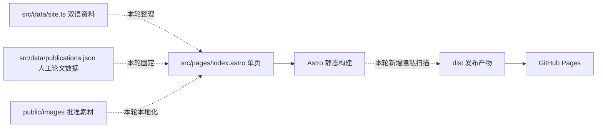

# Haibiao Zhang 双语学术主页 -- 施工交工单

> 独立性: codex-exec-independent | strong | model=unknown
> 日期: 2026-09-20

## 总结

本次施工把原有 Astro 学术主页改造成了张海彪的中英双语个人主页，并发布到 `https://codeocd.github.io/`。设计文档归纳出的十类核心目标中，八类已经完整实现；隐私边界和完整验证两类因同一个自动测试缺口暂列部分完成：证书图片本身已经正确遮挡，但构建产物扫描尚未把四张证书的完整发明人或作者名单列入禁止项。主页、双语切换、研究内容、媒体预览、移动端体验和 Pages 发布均已工作，没有需要用户提供账号、凭证或配置的阻塞。

## spec 目标逐条对账

| spec 目标 | 状态 | 实际效果 | 备注 |
|-----------|------|----------|------|
| 只展示 Haibiao Zhang / 张海彪的确认身份与联系方式 | 完成 | 首屏展示姓名、博士生身份、USTC、合肥、邮箱、GitHub、Google Scholar 和微信入口，浏览器标题固定为 Haibiao Zhang | 未发现旧模板作者身份、旧主页或 CV 入口 |
| 按学术叙事顺序呈现经历、论文、在研工作、开源、知识产权、技能与荣誉 | 完成 | 一篇第一作者论文、三篇合作论文和 TWCS 在研工作分区展示；开源部分只保留 senpai-skill，并注明核心贡献者 | TWCS 中英文状态已分别统一为 Under Review 和在审 |
| 头像、微信、五张研究图和机构标识全部本地提供 | 完成 | 页面不依赖临时剪贴板路径或外部图片站；研究图采用完整容纳方式，点击可放大查看 | CFEDR 使用六面板替换图，未发现旧等高线图进入公开目录 |
| 四张证书公开副本完成隐私处理 | 完成 | 发明人、作者和详细地址区域已遮挡，证书标题、编号、日期、权利人、二维码和条码仍可见 | 二维码可能通向登记机关公开信息，页面没有作超出实际遮挡范围的承诺 |
| 保留克制的编辑式学术视觉和桌面、手机布局 | 完成 | 页面采用资料侧栏加正文叙事栏，研究图与证书保持从属层级；桌面和手机均无横向溢出记录 | 生产浏览器记录显示 `scrollWidth` 等于 `clientWidth` |
| 英文默认、中文原位切换并记住选择 | 完成 | 首次访问使用英文；切换中文后姓名、正文、状态和有意义图片的替代文本同步变化，刷新后仍保持中文 | 文档标题始终保持 Haibiao Zhang，符合约定 |
| 弹窗、手机导航和减少动画模式可访问 | 完成 | 微信、研究图和证书共用原生对话框，支持关闭按钮、背景点击、Escape、焦点恢复和背景滚动锁定 | Playwright 覆盖手机菜单、键盘路径和 reduced motion（减少动画偏好） |
| 清除 CV、敏感字段、旧模板资源和自动 Scholar 数据 | 部分完成 | 公开 CV、旧路由、CRAFT、排除的数量表述、旧模板身份和 Scholar 定时任务均未进入部署产物 | 构建扫描尚未包含四张证书的完整贡献者名单禁止项 |
| 延续 Astro 静态架构并通过 GitHub Pages 发布 | 完成 | 类型化双语数据经 Astro 构建为静态页面，canonical（页面规范地址）指向正式网址，GitHub Actions 验证后再上传 Pages | 最终 workflow `35459315033` 已成功完成 |
| 完整执行内容、隐私、构建、浏览器和上线后验证 | 部分完成 | 已有内容 13/13、Scholar 10/10、dist 1/1、Astro 零诊断、Playwright 13 通过且 1 项按预期跳过，以及生产 HTTP 200 证据 | 需先补齐证书贡献者名单扫描，才能让自动门禁完全符合设计文档 |

结论：主页主体和线上发布已经完成，剩余工作不是页面返工，而是补齐一类明确的隐私回归测试。

## 施工细节

### 内容与信息架构

| 改之前 | 改之后 |
|--------|--------|
| 模板数据混有旧站点身份、旧论文和公开 CV | `src/data/site.ts` 只保存张海彪确认过的双语资料、经历、知识产权与链接 |
| 已发表论文和在研项目边界不清 | 四篇已发表论文由本地人工数据维护，TWCS 单独进入在研工作并标注审稿状态 |
| 开源贡献容易被理解为仓库所有权 | 页面只展示 `senpai-skill`，角色明确为 Core Contributor / 核心贡献者 |
| Scholar 数据可能自动改变页面 | 定时同步已禁用，页面不展示引用数，论文元数据需要人工核对后更新 |



设计文档没有要求引入新的客户端框架，因此施工继续使用 Astro 模板和少量浏览器脚本：类型化数据负责内容，页面模板负责组合，语言和弹窗逻辑留在当前页面内。这保留了原项目的静态部署方式，也减少了新的运行依赖。

### 图片、证书与媒体预览

改之前：外部或临时素材路径 → 运行时可能失效；证书原图 → 贡献者和地址存在公开风险

改之后：批准素材 → 优化或遮挡处理 → `public/images` 分类目录 → Astro 页面 → 通用原生对话框

头像被裁成适合网页使用的方形副本，源文件未被修改。微信图保留“小张同学”和“安徽 合肥”，只有用户点击微信入口后才显示。五张研究图均保留图例、坐标轴和主要标签；缩略图使用完整容纳方式，放大预览也不会裁切科学内容。

四张证书经原始分辨率检查后确认：应隐藏的发明人、作者或地址区域已经被实色遮挡；证书编号、授权或登记日期、权利人、二维码和条码仍可辨认。遮挡脚本记录在 `scripts/prepare_homepage_assets.py`，以后更换源图时应重新核对遮挡坐标。

### 双语与交互

页面通过 `data-lang` 保存中英文内容，EN / 中文控件切换 `html` 的语言状态，并把选择写入 `haibiao-site-language`（浏览器本地存储）。本轮进一步让头像、论文图、TWCS 图和证书缩略图的 `alt`（图片替代文本）随语言同步更新，同时把 TWCS 中文状态改为精确的 `AAAI 2027 · 在审`。

媒体预览使用浏览器原生 `<dialog>`。打开后焦点进入关闭按钮，Tab 不会离开弹窗；关闭按钮、背景点击或 Escape 都可退出，随后焦点返回原触发控件，页面滚动锁也会解除。手机导航在选择目标后自动收起，减少动画偏好会关闭非必要过渡。

### 构建与发布

上一轮发现页面只有 `og:url`，没有 canonical。本轮在 `<head>` 中从 `Astro.site` 输出唯一的 `https://codeocd.github.io/` canonical，并加入浏览器断言。

构建门禁现在按以下顺序执行：

```text
内容测试 → Scholar 单元测试 → Astro 类型检查与构建 → dist 隐私扫描 → Playwright 桌面/手机测试 → 上传 Pages
```

新增的 `tests/dist-privacy.test.mjs` 会递归检查构建产物路径和文本文件，已经覆盖电话、详细地址、CRAFT、排除的数量表述和旧模板身份。当前唯一未闭合之处是它没有列出证书完整贡献者名单，所以未来若有人误把名单写入页面，门禁不会因此失败。

## 验证情况

提交 `9cd7e6bd4d9cefdf040005cd30ef5016af4b1d9a` 的本地记录为：内容测试 13/13、Scholar 测试 10/10、构建产物隐私测试 1/1、Astro 零诊断、Playwright 13 项通过且 1 项按桌面条件预期跳过。GitHub Pages workflow `35459315033` 随后成功完成。

生产地址返回 HTTP 200，标题为 Haibiao Zhang，canonical 为 `https://codeocd.github.io/`。新浏览器会话切换到中文后可见 `AAAI 2027 · 在审`，头像、论文和证书具有中文替代文本，页面宽度没有横向溢出。

本次只读环境因 `spawn EPERM` 不能重新运行 Node 或 Playwright，内置生产浏览器也不可用；因此以上运行结果依赖提交记录、成功的 Pages workflow 和用户提供的生产浏览器证据。当前模型与请求的 Codex CLI 默认模型是否完全一致也无法确认。

## 后续可操作

**还剩什么**

在隐私测试中增加四张批准证书的完整发明人或作者名单禁止项。源码扫描和 `dist` 扫描应共用同一清单，并增加一个变异用例：临时向测试产物注入任一完整名单时，测试必须失败。完成后再运行完整门禁，即可关闭最后一个交付缺口。

**怎么复现**

1. 在隔离测试夹具中向一个 HTML 文件写入任一证书的完整贡献者名单。
2. 运行 `npm run test:dist`，当前实现仍会通过，这就是剩余问题。
3. 补充禁止清单后重复运行，测试应明确报告包含被禁名单的文件。
4. 最后运行 `npm run test:all`；预期内容、Scholar、Astro 构建、dist 隐私扫描和 Playwright 全部通过。

**去哪看**

- 生产主页：`https://codeocd.github.io/`
- 最终 Pages workflow：`https://github.com/codeocd/codeocd.github.io/actions/runs/35459315033`
- 双语内容：`src/data/site.ts`
- 页面和交互：`src/pages/index.astro`
- 构建产物隐私扫描：`tests/dist-privacy.test.mjs`
- 完整门禁入口：`package.json`
- 证书处理脚本：`scripts/prepare_homepage_assets.py`
