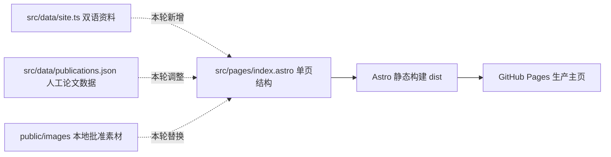

# Haibiao Zhang 双语学术主页 -- 施工交工单

> 独立性: codex-exec-independent | strong | model=unknown
> 日期: 2026-09-20

## 总结

本次施工把原有学术主页模板改造成了张海彪的中英双语个人主页，并发布到 `https://codeocd.github.io`。身份资料、学术经历、论文分组、在研工作、开源贡献、知识产权、技能与荣誉已经进入正式页面，头像、微信、五张研究图、三所机构标识和四张隐私处理证书均改为本地资源。按设计文档的十类核心目标计算，六类已完整落地，四类仍有明确的小范围收尾：构建产物缺少完整隐私扫描、页面没有 canonical（页面规范地址标签）、图片替代文本没有随中文模式切换、TWCS 中文状态没有使用约定的“在审”。发布链路已经工作，没有需要用户提供账号或凭证的阻塞。

## spec 目标逐条对账

| spec 目标 | 状态 | 实际效果 | 备注 |
|-----------|------|----------|------|
| 只展示 Haibiao Zhang / 张海彪的确认身份与联系方式 | 完成 | 首屏显示姓名、博士生身份、USTC、合肥、邮箱、GitHub、Google Scholar 和微信入口，浏览器标题保持 Haibiao Zhang | 未发现原模板作者的公开身份或简历入口 |
| 按约定顺序呈现经历、论文、在研工作、开源、知识产权、技能与荣誉 | 部分完成 | 单页已经按学术叙事顺序组织；一篇第一作者论文、三篇合作论文和一项在研工作彼此分开 | TWCS 中文状态当前为“审稿中”，应改为设计文档指定的“在审” |
| 五张研究图全部本地托管并可完整放大 | 完成 | 研究图保留图例、标签和坐标轴，缩略图使用 contain（完整容纳、不裁掉内容），点击后进入通用预览框 | CFEDR 使用的是六面板替换图，没有发现旧等高线图进入公开目录 |
| 使用确认头像和完整微信图片 | 完成 | 头像进入个人资料区；微信图片仅在用户点击后显示，并保留“小张同学”和“安徽 合肥” | 微信预览支持关闭按钮、背景点击和 Escape |
| 四张证书公开副本完成隐私处理 | 完成 | 发明人或作者列表及详细地址被遮挡，证书标题、编号、日期、权利人、二维码和条码仍可见 | 二维码仍可能通向登记机关公开信息，页面没有作超出实际遮挡范围的隐私承诺 |
| 保留克制的编辑式学术视觉和桌面/手机布局 | 完成 | 页面使用资料侧栏加正文叙事栏，研究图与证书保持从属层级；响应式样式和横向溢出测试已经定义 | 本环境不能重新打开生产浏览器，最终视觉结论依赖已成功的 CI 和既有生产记录 |
| 英文默认、中文原位切换、语言持久化及键盘交互 | 部分完成 | 首次访问为英文，选择写入 localStorage（浏览器本地存储），刷新后保留；弹窗恢复焦点并锁定背景滚动 | 普通图片的 alt（图片替代文本）仍固定为英文，中文屏幕阅读体验没有完整落地 |
| 清除 CV、敏感字段、旧模板资源和 Scholar 定时同步 | 完成 | 两份公开 CV 已删除，Scholar 定时工作流已移除，论文缓存为人工维护且引用数为空 | 源码和公开目录未发现 CRAFT、排除的数量表述或旧模板公开资源 |
| 延续 Astro 静态架构并通过 GitHub Pages 发布 | 部分完成 | 类型化数据进入 Astro 页面，GitHub Actions 在上传 Pages 产物前运行 `npm run test:all`，生产地址可返回主页 | 配置了站点地址和 `og:url`，但页面没有输出 `rel=canonical` |
| 完整执行内容、隐私、构建、浏览器和上线后验证 | 部分完成 | 工作流 run 35458101053 对生产提交成功，生产地址记录为 HTTP 200 且标题正确 | 自动隐私测试没有递归扫描构建后的 `dist`；本次只读环境也无法重新执行浏览器交互 |

结论：主页的主要产品能力和发布链路已经形成，剩余工作集中在四个可以独立修复和自动验证的收尾项，不需要推翻现有页面结构。

## 施工细节

### 内容与信息架构

| 改之前 | 改之后 |
|--------|--------|
| 模板数据混有旧站点身份、旧论文与公开 CV | `src/data/site.ts` 只保存张海彪确认过的双语资料与链接 |
| 已发表论文与在研项目边界不清 | `src/data/publications.json` 保存四篇人工维护的已发表论文，TWCS 独立进入 Ongoing Research |
| 开源贡献容易被理解为仓库所有权 | 页面只展示 `senpai-skill`，角色明确写为 Core Contributor / 核心贡献者 |
| 证书元数据和扫描图直接展示风险较高 | 页面文字只展示标题、编号、日期和确认过的权利信息，公开图片先做遮挡 |

页面现在形成以下内容流：



实施时解决的主要问题是旧模板内容和自动 Scholar 更新路径会扩大公开边界。处理方式是删除公开 CV 与定时同步工作流，把论文来源固定为本地人工数据，并用明确列表划分第一作者论文、合作论文和在研项目。

设计文档没有规定具体的数据拼装方式，施工选择继续使用 Astro 服务端模板：`site.ts` 管双语展示数据，`publications.json` 管人工核对的论文元数据，`index.astro` 负责组合。这样没有为语言切换或弹窗额外引入客户端框架。

### 图片、证书与弹窗

公开资源按用途分到 `profile`、`contact`、`publications`、`institutions` 和 `ip` 目录。研究图与证书都使用同一个原生 `<dialog>` 预览器；原生 dialog（浏览器自带的模态窗口）提供背景隔离和 Escape 行为，页面代码补充了关闭按钮、背景点击、滚动锁定和焦点恢复。

```text
改之前：外部或临时素材路径 → 运行时可能失效，证书原图存在隐私风险
改之后：批准素材 → 本地处理副本 → public/images 分类目录 → Astro 页面与通用弹窗
```

四张证书逐张检查后可见：发明人、作者和详细地址区域已经遮挡；证书编号、授权或登记日期、权利人、二维码及条码仍保留。五张研究图也保持完整画面，没有发现坐标轴或图例被裁去。

### 双语与无障碍交互

页面通过 `data-lang` 同时保存中英文文本，右上角 EN / 中文按钮切换当前语言，并把选择保存为 `haibiao-site-language`。页面刷新时会先读取该值，因此不会跳转到另一条路由。标题固定为 Haibiao Zhang，中文模式只把页面中的可见姓名切换为张海彪。

弹窗中的图片说明会根据当前语言选择中英文值，但普通页面图片没有接入同一切换流程：头像、论文缩略图、TWCS 图和证书缩略图的 `alt` 仍在初始 HTML 中固定为英文。这不会阻止图片显示，却会影响中文屏幕阅读器用户，需要把双语替代文本连接到 `setLanguage`。

### 构建与发布

`.github/workflows/pages.yml` 使用 Node 24，安装 Chromium，运行完整 npm 门禁，然后上传 `dist` 并部署到 GitHub Pages。生产仓库为 `codeocd/codeocd.github.io`，当前本地 `main` 与 `origin/main` 均指向提交 `984826a7e3dbac8078dcaca9cf0640ac2d58a83b`。

页面已经输出 `og:url=https://codeocd.github.io/`，但没有 canonical。canonical（页面规范地址标签）用于向搜索引擎声明首选 URL，不能由 Astro 的 `site` 配置自动替代，必须在 `<head>` 中显式输出并测试。

现有内容测试会检查选定源码和公开文件名，但执行顺序是：

```text
源码内容测试 → Scholar 单元测试 → Astro 构建 → Playwright 浏览器测试
```

因此源码内容测试开始时没有本轮新构建的 `dist`，后续浏览器测试也只检查了两个禁止字符串。设计文档要求的完整构建产物隐私扫描尚未真正进入门禁。

## 验证情况

GitHub Actions run `35458101053` 已记录为成功，关联生产提交 `984826a7e3dbac8078dcaca9cf0640ac2d58a83b`；生产地址在 2026-09-20 返回 HTTP 200，页面标题为 Haibiao Zhang。源码中的 Playwright 用例覆盖英文默认、中文持久化、手机导航、三类弹窗关闭方式、焦点恢复、减少动画和横向溢出。

本次环境为只读模式，Node 测试因子进程 `EPERM` 无法启动，Python 测试因没有可写临时目录无法完整运行；可用浏览器和外网访问也不可用。因此没有重新播放生产端外链、语言切换和媒体交互，模型版本一致性同样无法确认。

## 后续可操作

**还剩什么**

1. 在构建后递归扫描 `dist`，覆盖电话、详细地址、CRAFT、排除的数量表述、完整证书贡献者名单、旧模板身份和旧路由。
2. 在 `<head>` 输出 `https://codeocd.github.io/` 的 canonical，并同时测试源码、构建 HTML 和生产页面。
3. 让所有有意义图片的 alt 随 EN / 中文切换，并加入中英文浏览器断言。
4. 把 TWCS 中文状态改为 `AAAI 2027 · 在审`，加入精确文本测试。

**怎么复现**

完成以上修改后运行 `npm run test:all`。部署成功后使用新的无痕浏览器打开 `https://codeocd.github.io/`：首次应为英文；切换中文并刷新后仍应为中文；屏幕阅读器或浏览器无障碍树中的头像、论文图和证书说明应为中文；微信、论文图和证书均应能打开并通过 Escape 关闭；查看页面源代码应能找到唯一的 `rel=canonical`，值为 `https://codeocd.github.io/`。

**去哪看**

- 生产主页：`https://codeocd.github.io/`
- 生产工作流：`https://github.com/codeocd/codeocd.github.io/actions/runs/35458101053`
- 双语数据：`src/data/site.ts`
- 页面与交互：`src/pages/index.astro`
- 内容和隐私测试：`tests/content.test.mjs`
- 浏览器测试：`tests/e2e/homepage.spec.ts`
- Pages 流程：`.github/workflows/pages.yml`
